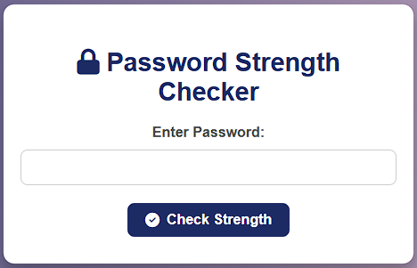

# **FortiPass** 🔒

FortiPass is a sleek and robust **Password Strength Checker** designed to help users create stronger, more secure passwords. Built with Flask and Docker, FortiPass evaluates password strength based on length, complexity, and patterns, ensuring users get feedback to enhance their password security.

---

## 🚀 **Features**

- **Real-Time Strength Analysis**: Checks password length, character diversity, and common patterns.
- **Dynamic Feedback**: Provides tailored suggestions to improve weak passwords.
- **Compromised Password Check**: (Optional) Integrates with HaveIBeenPwned API to check if a password appears in known data breaches.
- **Elegant UI**: Simple, user-friendly, and mobile-responsive design.

---

## 🖼️ **Project Preview**



---

## 🛠️ **Tech Stack**

- **Backend**: Flask (Python)
- **Frontend**: HTML, CSS, Font Awesome for icons
- **Containerization**: Docker
- **Cloud-Ready**: Designed for easy deployment on AWS, DigitalOcean, GCP, and other cloud providers

---

## 📦 **Getting Started**

### **Prerequisites**

- [Python 3.9+](https://www.python.org/downloads/)
- [Docker](https://docs.docker.com/get-docker/)
- (Optional) [Docker Hub Account](https://hub.docker.com/)

### **Setup Instructions**

1. **Clone the Repository**

   ```bash
   git clone https://github.com/Ram001-code/FortiPass.git
   cd FortiPass
   ```

2. **Install Dependencies**

   ```bash
   pip install -r requirements.txt
   ```

3. **Run Locally**

   ```bash
   flask run
   ```

4. **Build Docker Image**

   ```bash
   docker build -t fortipass-app .
   ```

5. **Run Docker Container**

   ```bash
   docker run -d -p 80:80 fortipass-app
   ```

   Your app should now be accessible at `http://localhost`.

---

## 🐳 **Deploying with Docker Hub**

1. **Log in to Docker Hub**: `docker login`
2. **Tag the Image**:
   ```bash
   docker tag fortipass-app ramgameer/fortipass:latest
   ```
3. **Push to Docker Hub**:
   ```bash
   docker push ramgameer/fortipass:latest
   ```
4. **Pull and Run Anywhere**:
   ```bash
   docker pull ramgameer/fortipass:latest
   docker run -d -p 80:80 ramgameer/fortipass:latest
   ```

---

## 🌐 **Cloud Deployment Options**

- **AWS EC2**: Deploy using an EC2 instance and install Docker.
- **DigitalOcean Droplet**: Use Docker Droplet for easy setup.
- **Google Cloud Run**: Deploy directly from Docker Hub using Google Cloud’s serverless platform.
- **Render.com**: A quick, cost-effective way to deploy Docker images.

---

## 📂 **Project Structure**

```plaintext
FortiPass/
├── app.py                 # Main application code
├── Dockerfile             # Docker setup file
├── requirements.txt       # List of dependencies
└── templates/
    └── index.html         # HTML template for the app
```

---

## 👤 **Contributing**

Contributions are welcome! Feel free to fork the repository and create a pull request.

1. Fork the project
2. Create your feature branch: `git checkout -b feature/AmazingFeature`
3. Commit your changes: `git commit -m 'Add some AmazingFeature'`
4. Push to the branch: `git push origin feature/AmazingFeature`
5. Open a pull request

---

## 📜 **License**

This project is licensed under the MIT License. See the [LICENSE](LICENSE) file for details.

---

## 📞 **Contact**

- **Developer**: [Ram Kansal](https://github.com/Ram001-code)
- **Project Link**: [FortiPass on GitHub](https://github.com/Ram001-code/FortiPass)